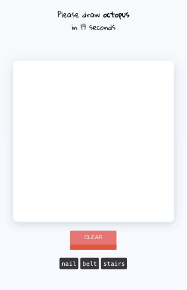

<section>
	

		About • 
		Blog • 
		Projects
	

	

</section>

### Simple Web3 Wrapper

All required steps to create and deploy a simple web3 app on local blockchain. [[GitHub]](https://github.com/gov-ai/web3_wrapper)

### Market + Tech = MarkTech

Market scraping, analytics and prediction [[GitHub]](https://github.com/INF800/marktech)

### Serverless Social Bot

Serverless bot to post Twitter activity over Linkedin [[GitHub]](https://github.com/INF800/twitter_linkedin_bot)

### Motion Capture

Motion capture built for [Crejo.fun](https://crejo.fun)

### Gesture Recognition

Realtime client-side gesture recognition built for [Crejo.fun](https://crejo.fun)

### Doodle Recognition

Doodle Recognition with top 3 accuracy > 97% for 61 classes. Built with Tensorflow, ReactJS and FastAPI [[GitHub]](https://github.com/INF800/qdraw)

### Q-Learning

Q-Learning implementation from scratch using Numpy, FastAPI and ReactJS. [[Blog]](https://INF800.github.io/whoami/q-learning) [[GitHub]](https://github.com/INF800/game-one)

### Teachable Machine

Face detection and recognition using client-side Tensorflow.js with simple transfer learning. Currently relies on Facemesh model, Mobilenet and KNN classifier. [[Live]](https://INF800.github.io/face-recognition/) [[GitHub]](https://github.com/INF800/face-recognition)

### Autocomplete

Autocomplete input field using custom version of Trie tree grown with 10k most popular english words from Google-1000-English. [[Live]](https://incomplete-me.herokuapp.com/) [[GitHub]](https://github.com/INF800/next-word-sentence-pred-api) 

### Choice Driven Chatbot

Build custom chatbot with predefined knowledge graph supported by drag-and-drop UI [WIP]. [[Live]](https://INF800.github.io/chatbot-api-demo/) [[GitHub]](https://github.com/INF800/chatbot-api-demo/)

### Ghost Nation
A.I powered peer-to-peer client side video stream/chat with - video/audio chat, text messaging, unlimited size file transfer and person detection. [[Live]](https://INF800.github.io/P2P-V2/) [[GitHub]](https://github.com/INF800/P2P-V2)

### Filter for communities

Filter for communities is an open-source application/API that let's you connect with people whom you are looking for. [[Live]](https://vis-filter.herokuapp.com/) [[GitHub]](https://github.com/INF800/FILTER)

### Tic Tac Toe

Play Tic-Tac-Toe powered by minimax algorithm. Optimized with memoisation and alpha-beta pruning. [[Live]](https://INF800.github.io/tictactoe/) [[GitHub]](https://github.com/INF800/tictactoe)

### When were you Productive ?
Find at which interval of time you were most productive/profited using Kadane's algorithm. Cython Backend for faster processing. [[Live]](https://max-ss.herokuapp.com/) [[GitHub]](https://github.com/INF800/Kladane-MSS)

### Live Forex

Get real-time live forex market details for popular 26 currency pairs like high value, change in price, percent change and much more. [[Live]](https://realtime-forex.herokuapp.com/) [[GitHub]](https://github.com/INF800/realtime-forex-api)

### Client Side Web Diary
Built on top of IndexedDB you can write diary that you can truly own. Encryption using AES symetric key. [[Live]](http://INF800.github.io/logs) [[GitHub]](https://github.com/INF800/logs)
